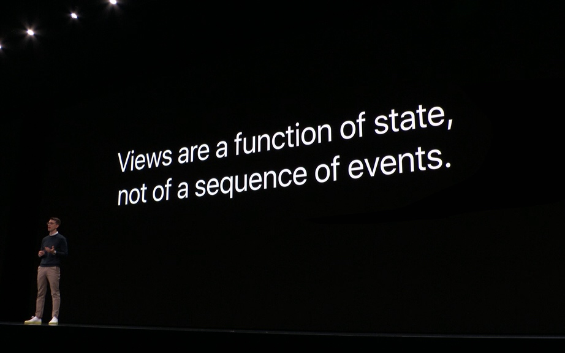
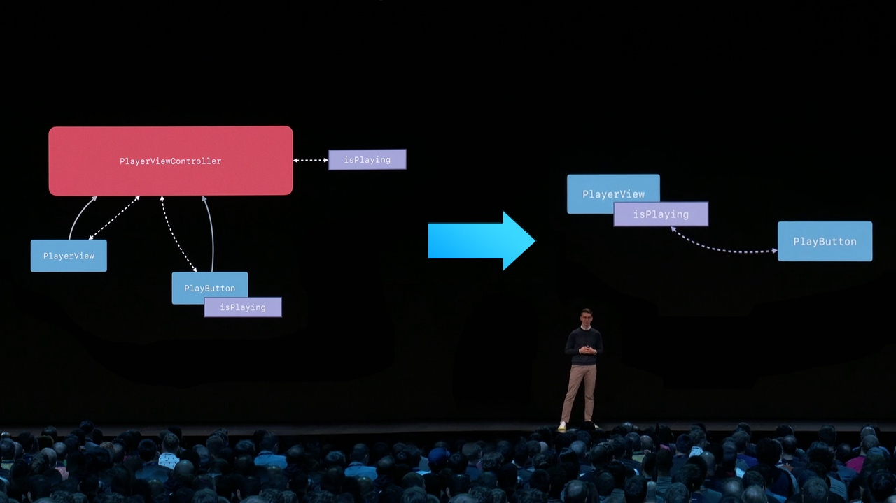
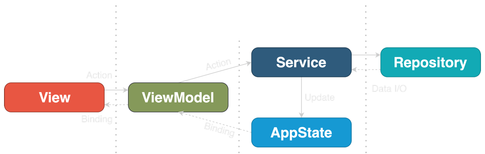
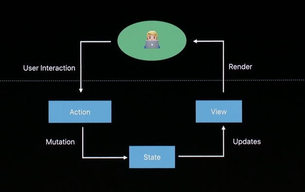
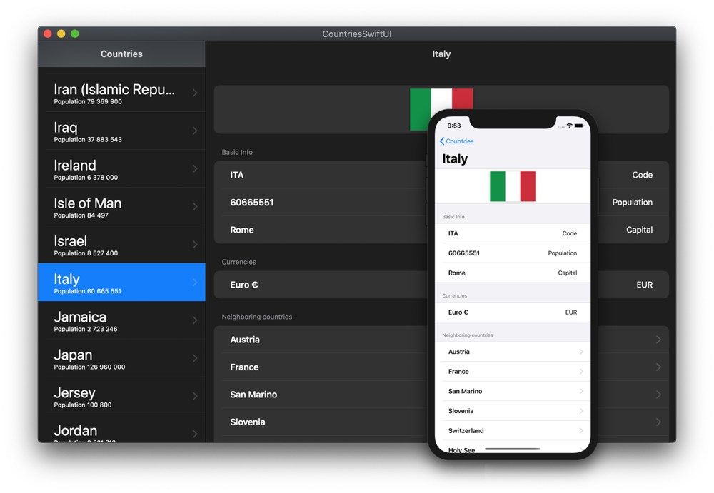

- [Чистая архитектура для SwiftUI](#чистая-архитектура-для-swiftui)
  - [Что концептуально меняется?](#что-концептуально-меняется)
  - [MVVM как новый стандарт архитектуры](#mvvm-как-новый-стандарт-архитектуры)
  - [Под капотом SwiftUI базируется на ELM](#под-капотом-swiftui-базируется-на-elm)
  - [Координатор – SwiftUI](#координатор--swiftui)
  - [Применимы ли VIPER, RIBs и VIP для SwiftUI?](#применимы-ли-viper-ribs-и-vip-для-swiftui)
  - [Чистая архитектура](#чистая-архитектура)
  - [AppState](#appstate)
  - [View](#view)
  - [Interactor](#interactor)
  - [Repository](#repository)
  - [Заключение](#заключение)
  - [Замечания от создателя перевода:](#замечания-от-создателя-перевода)

# Чистая архитектура для SwiftUI

> Это перевод
> [этой](https://nalexn.github.io/clean-architecture-swiftui/?utm_source=nalexn_github)
> статьи

Можете себе представить – UIKit уже 11 (16) лет! С момента выпуска iOS SDK в
2008 году, мы создавали приложения с его помощью. И всё это время разработчики
упорно искали наилучшую архитектуру для своих приложений. Всё началось с
**MVC**, но позже мы наблюдали подъемы **MVP**, **MVVM**, **VIPER**, **RIB** и
**VIP**.

Но недавно кое-что произошло. Это "что-то" настолько существенно, что
большинство архитектурных паттернов, используемых в iOS, скоро станут историей.

Я говорю о SwiftUI. От этого не убежать. Нравится вам это или нет – это будущее
iOS разработки. И это меняет правила игры с точки зрения задач, с которыми мы
сталкиваемся при проектировании архитектуры.

## Что концептуально меняется?

UIKit был **императивным,
[event-driven](https://ru.wikipedia.org/wiki/%D0%A1%D0%BE%D0%B1%D1%8B%D1%82%D0%B8%D0%B9%D0%BD%D0%BE-%D0%BE%D1%80%D0%B8%D0%B5%D0%BD%D1%82%D0%B8%D1%80%D0%BE%D0%B2%D0%B0%D0%BD%D0%BD%D0%B0%D1%8F_%D0%B0%D1%80%D1%85%D0%B8%D1%82%D0%B5%D0%BA%D1%82%D1%83%D1%80%D0%B0)**
фреймворком. Мы могли бы ссылаться на каждое view в иерархии, обновлять его
внешний вид при загрузке view или реакции на событие (нажатие кнопки или новые
данные, доступные для отображения в UITableView). Мы использовали callbacks,
delegates, [target-actions](https://swiftblog.org/mehanizm-target-action/) для
обработки этих событий.

Сейчас это в прошлом. SwiftUI – это **декларативный, state-driven** фреймворк.
Мы не можем ссылаться на какое-либо view, мы также не можем менять view по
событию. Вместо этого мы меняем состояние (state), привязанное к view.
Delegates, target-actions, responder chain, KVO –
[весь набор callback'ов](https://nalexn.github.io/callbacks-part-1-delegation-notificationcenter-kvo/)
был заменен замыканиями и привязками (closures and binding).



> "View – это функции состояния, а не последовательность событий"

Таким образом view в SwiftUI – это просто функция. Вы предоставляете ему входные
данные (state) – оно рисует выходные данные. И единственный способ изменить
выходные данные – изменить входные: мы не можем трогать алгоритм (body) добавляя
или удаляя subview – всё возможные изменения в отображаемом UI должны быть
объявлены в `body` и не могут быть изменены в runtime.

С точки зрения SwiftUI мы не добавляем и не удаляем subview, а включаем и
выключаем различные части UI в соответствии с предопределенным алгоритмом (со
структурной схемой).

## MVVM как новый стандарт архитектуры

SwiftUI поставляется со "встроенным" MVVM.

В простом примере, где `View` не зависит от внешнего state, его внутренние
`@State` переменные берут на себя роль `ViewModel`.

Для более сложных сценариев `View` можно ссылаться на внешний
`ObservableObject`, он в итоге будет `ViewModel`.

Так или иначе, способ работы в view в SwiftUI с состояниями (state) очень
напоминает классический MVVM (если только мы не введем более сложный граф
программных сущностей).



> "И что же, ViewController вам больше не нужен"

Давайте рассмотрим этот простой пример использования MVVM для SwiftUI
приложений.

**Model** – контейнер данных

```swift
struct Country {
    let name: String
}
```

**View:** – представление (view) в SwiftUI

```swift
struct CountriesList: View {
    @ObservedObject var viewModel: ViewModel

    var body: some View {
        List(viewModel.countries) { country in
            Text(country.name)
        }
        .onAppear {
            self.viewModel.loadCountries()
        }
    }
}
```

**ViewModel** – `ObservableObject`, который инкапсулирует бизнес-логику и
позволяет `View` наблюдать за изменениями состояния.

```swift
extension CountriesList {
    class ViewModel: ObservableObject {
        @Published private(set) var countries: [Country] = []

        private let service: WebService

        func loadCountries() {
            service.getCountries { [weak self] result in
                self?.countries = result.value ?? []
            }
        }
    }
}
```

В этом простом примере `View` появляется на экране и `onAppear` вызывает
`loadCountries()` на `ViewModel`, осуществляя выход в сеть для загрузки новых
данных внутри `WebService`. `ViewModel` получает данные через callback и пушит
данные через `@Published` в переменную `countries`, которая наблюдается у
`View`.



Хоть эта статья и посвящена чистой архитектуре, я получал много вопросов о
применении MVVM в SwiftUI, поэтому я взял оригинальный
[пример проекта](https://github.com/nalexn/clean-architecture-swiftui) и
портировал его на MVVM в
[отдельной ветке](https://github.com/nalexn/clean-architecture-swiftui/tree/mvvm).
Вы можете сравнить два варианта и выбрать тот, который лучше всего соответствует
вашим потребностям. Ключевые особенности:

- Ванильная реализация SwiftUI + Combine
- Разделение слоев Представления, Бизнес-логики и Data Access
- Полное покрытие тестами, включая и UI (спасибо
  [ViewInspector](https://github.com/nalexn/ViewInspector))
- Redux-like централизованное AppState, как единственный источник правды (single
  source of truth)
- Программная навигация (поддержка deep-link)
- Простой, но гибкий сетевой слой, основанный на дженериках
- Обработка системных событий (размывания иерархии view, когда приложение
  неактивно)

## Под капотом SwiftUI базируется на ELM

Посмотрите пару минут этого доклада
["MCE 2017: Ясухиро Инами, Elm в Swift"](https://www.youtube.com/embed/U805TqsDIV8)
с 28:26

У этого парня был рабочий прототип SwiftUI в 2017!

Есть ли ощущение, что мы на реалити шоу, где SwiftUI – наполовину сирота,
который только что узнал, кто его отец?

В любом случае, нас интересует, можем ли мы использовать какие-либо ELM
концепции, которые сделают наши приложения лучше.

Я ознакомился с описанием
[ELM архитектуры](https://guide.elm-lang.org/architecture/) на сайте ELM
language и... не нашел ничего нового. SwiftUI базируется на тех же принципах,
что и ELM:

- Model – состояние вашего приложения
- View – способ преобразовать ваше состояние в HTML
- Update – способ обновить состояние на основе сообщения

> - Model – the state of your application
> - View – a way to turn your state into HTML
> - Update – a way to update your state based on messages

Мы где-то это видели, не так ли?



У нас уже есть `Model`, `View` автоматически генерируется из `Model`,
единственное, что мы можем настроить, это способ `Update` доставки. Мы можем
пойти по пути **REDUX** и использовать паттерн `Command` для изменения состояния
вместо того, чтобы позволять представлениям SwiftUI и другим модулям напрямую
записывать данные в состояние. Хотя я предпочитал использовать REDUX в своих
предыдущих проектах UIKit (ReSwift ❤), сомнительно, нужно ли это для приложения
на SwiftUI — потоки данных (data flow) уже находятся под контролем и их легко
отследить.

## Координатор – SwiftUI

Координатор (он же маршрутизатор) был неотъемлемой частью архитектур VIPER, RIBs
и MVVM-R. Выделение отдельного модуля для навигации по экрану было вполне
оправдано в приложениях UIKit – прямая маршрутизация от одного ViewController к
другому привела к их тесному взаимодействию, не говоря уже об аде кодирования
deep link'ов к экрану глубоко внутри иерархии ViewController.

Добавить координатора в UIKit было довольно просто, потому что UIView (и
UIViewController) являются независимыми от среды объектами, которые вы могли бы
использовать, добавляя/удаляя из иерархии в любое время.

Когда дело доходит до SwiftUI, такой динамизм невозможен по замыслу: иерархия
статична, а все возможные навигации определяются и фиксируются во время
компиляции. Нет способа вносить изменения в структуру иерархии во время
выполнения: вместо этого навигация полностью контролируется изменением состояния
с помощью `Bindings`: используете `NavigationView`, `TabView` или `.sheet()`,
каждый раз вы увидите `init` который принимает параметр `Binding` для
маршрутизации.

"View - это функция состояния”, помните? Ключевое слово здесь - **функция**.
Алгоритм преобразования данных состояния в визуализированное изображение.

Это объясняет, почему извлечение маршрутизации из представления SwiftUI является
довольно сложной задачей: маршрутизация является неотъемлемой частью этого
алгоритма рисования.

Координаторы стремились решить две проблемы:

- Разделение ViewControllers друг от друга
- Программная навигация

В SwiftUI встроен механизм программной навигации по вышеупомянутому `Bindings`.
У меня есть [специальная статья](https://nalexn.github.io/swiftui-deep-linking/)
об этом.

Что касается разделения представлений в SwiftUI, то с этим всё просто. Если вы
не хотите, чтобы view `A` напрямую ссылался на view `B`, вы можете просто
вставить `B` как дженерик для `A` и на этом закончить.

Вы также можете использовать этот же подход для абстрагирования от того, что
view `A` может открывать `B` (используя `TabView`, `NavigationView` и т.д.),
хотя я не вижу проблемы прямо объявить это сразу в вашем view. При необходимости
вы можете легко изменить модель маршрутизации прямо на месте, не касаясь
представления `B`.

И не забывайте о `@ViewBuilder` и `AnyView` - двух других способах сделать тип
`B` неявным для `A`.

Учитывая вышесказанное, я считаю, что SwiftUI сделал `Coordinator` излишним: мы
можем изолировать представления, используя дженерик параметры или `@ViewBuilder`
и осуществлять программную навигацию с помощью стандартных инструментов.

Есть
[практический пример](https://quickbirdstudios.com/blog/coordinator-pattern-in-swiftui/)
использования координаторов в SwiftUI от quickbirdstudios, однако, на мой
взгляд, это излишество. Кроме того, у этого подхода есть несколько недостатков,
таких как предоставление координаторам полного доступа ко всем ViewModels, но вы
должны проверить это и решить для себя.

## Применимы ли VIPER, RIBs и VIP для SwiftUI?

Существует множество отличных идей и концепций, которые мы можем позаимствовать
у этих архитектур, но, в конечном счете, каноническая реализация любой из них не
имеет смысла для приложения SwiftUI.

Во-первых, как я только что уточнил, больше нет практической необходимости иметь
`Coordinator`.

Во-вторых, совершенно новый дизайн data flow в SwiftUI в сочетании с встроенной
поддержкой view-state binding сократил требуемый код для первоначальной
настройки до такой степени, что `Presenter` становится бесполезной сущностью, не
делающей ничего полезного.

Наряду с уменьшением количества модулей в паттерне мы выясняем, что нам также не
нужен `Builder`. Итак, по сути, весь шаблон просто разваливается, поскольку
**проблем, на решение которых он был направлен, больше не существует**.

SwiftUI внесла свой собственный набор задач в проектирование системы, поэтому
паттерны, которые у нас были для UIKit, пришлось переделывать с нуля.

Есть [попытки](https://theswiftdev.com/) (сейчас их нет на этом сайте)
придерживаться любимых архитектур, несмотря ни на что, но, пожалуйста, не
делайте этого.

## Чистая архитектура

Давайте обратимся к
[чистой архитектуре дяди Боба](https://blog.cleancoder.com/uncle-bob/2012/08/13/the-clean-architecture.html),
прародителю VIP.

> Разделяя программное обеспечение на слои и соблюдая Правило зависимостей, вы
> создадите систему, которая по сути своей поддается тестированию, со всеми
> вытекающими отсюда преимуществами.

Чистая архитектура довольно либеральна в отношении количества слоев, которые мы
должны вводить, потому что это зависит от предметной области приложения.

Но в наиболее распространенном сценарии для мобильного приложения нам
потребуется три слоя:

- Слой презентации
- Слой бизнес-логики
- Слой доступа к данным

Итак, если бы мы прогнали эти требования чистой архитектуры через особенности
SwiftUI, мы бы получили что-то вроде этого:


Существует
[демонстрационный проект](https://github.com/nalexn/clean-architecture-swiftui),
который я создал, чтобы проиллюстрировать использование этого паттерна.
Приложение взаимодействует с restcountries.eu REST API для отображения списка
стран и подробной информации о них.

## AppState

AppState - это единственная сущность в шаблоне, которая должна быть объектом, а
именно `ObservableObject`. В
[качестве альтернативы](https://nalexn.github.io/swiftui-observableobject/) это
может быть структура, обернутая в `CurrentValueSubject` из Combine.

Как и в случае с **Redux**, AppState работает как единственный источник правды и
сохраняет состояние всего приложения, включая данные пользователя, токены
аутентификации, состояние навигации по экрану (выбранные вкладки, представленные
модальные окна) и состояние системы (активен/в фоновом режиме и т.д.).

AppState ничего не знает ни о каком другом слое и не содержит никакой
бизнес-логики.

Пример
[AppState](https://github.com/nalexn/clean-architecture-swiftui/blob/master/CountriesSwiftUI/Injected/AppState.swift)
из демонстрационного проекта Countries:

```swift
class AppState: ObservableObject, Equatable {
    @Published var userData = UserData()
    @Published var routing = ViewRouting()
    @Published var system = System()
}
```

## View

Это обычный view в SwiftUI. Он может быть без состояния или иметь локальные
`@State` переменные.

Когда объект view создался, оно получает `AppState` и `Interactor` посредством
стандартного внедрения зависимостей переменной SwiftUI, приписываемой с помощью
`@Environment`, `@EnvironmentObject` или `@ObservedObject`.

Side effects запускаются действиями пользователя (например, нажатием на кнопку)
или событием жизненного цикла просмотра `onAppear` и пересылаются на
`Interactor`:

```swift
struct CountriesList: View {
    @EnvironmentObject var appState: AppState
    @Environment(\.interactors) var interactors: InteractorsContainer

    var body: some View {
        ...
        .onAppear {
            self.interactors.countriesInteractor.loadCountries()
        }
    }
}
```

## Interactor

`Interactor` инкапсулирует бизнес-логику для конкретного `View` или группы
views. Вместе с `AppState` формирует слой бизнес-логики, который полностью
независим от представления и внешних ресурсов.

Она совсем не имеет состояния и ссылается только на объект `AppState`, введенный
(injected) как параметр конструктора.

Интеракторы должны быть реализованы протоколом, чтобы `View` могли
взаимодействовать с mock объектом `Interactor` в тестах.

Интеракторы получают запрос на выполнение задач, таких как получение данных из
внешних источников или совершение вычислений, но они никогда не возвращают
значения, например как в closure.

Вместо этого они пересылают результат в `AppState` или `Binding` от View.

`Binding` используется только в том случае, когда результат работы (данные)
принадлежат локально одному View и не принадлежат `AppState`, то есть его не
нужно сохранять или делиться с другими окнами в приложении.

[CountriesInteractor](https://github.com/nalexn/clean-architecture-swiftui/blob/master/CountriesSwiftUI/Interactors/CountriesInteractor.swift)
из демонстрационного проекта:

```swift
protocol CountriesInteractor {
    func loadCountries()
    func load(countryDetails: Binding<Loadable<Country.Details>>, country: Country)
}

// MARK: - Implemetation

struct RealCountriesInteractor: CountriesInteractor {
    let webRepository: CountriesWebRepository
    let appState: AppState

    init(webRepository: CountriesWebRepository, appState: AppState) {
        self.webRepository = webRepository
        self.appState = appState
    }

    func loadCountries() {
        appState.userData.countries = .isLoading(last: appState.userData.countries.value)
        weak var weakAppState = appState
        _ = webRepository.loadCountries()
            // Кастомный подписчик от автора
            .sinkToLoadable { weakAppState?.userData.countries = $0 }
    }

    func load(countryDetails: Binding<Loadable<Country.Details>>, country: Country) {
        countryDetails.wrappedValue = .isLoading(last: countryDetails.wrappedValue.value)
        _ = webRepository.loadCountryDetails(country: country)
            .sinkToLoadable { countryDetails.wrappedValue = $0 }
    }
}
```

## Repository

`Repository` это абстрактный gateway для чтения/записи данных. Обеспечивает
доступ к единой службе передачи данных, будь то веб-сервер или локальная база
данных.

У меня есть
[специальная статья](https://nalexn.github.io/separation-of-concerns/),
объясняющая, почему важно извлечь репозиторий.

Например, если приложение использует свой backend, API Google Maps и записывает
что-либо в локальную базу данных, будет три репозитория: два для разных
поставщиков веб-API и один для IO операций с БД.

Репозиторий не имеет состояний, не имеет возможности изменять `AppState`,
содержит только логику, связанную с работой с данными. Он ничего не знает о
`View` или `Interactor`.

Фактический Репозиторий должен быть скрыт за протоколом, чтобы `Interactor` мог
общаться с mocked `Repository` в тестах.

[CountriesWebRepository](https://github.com/nalexn/clean-architecture-swiftui/blob/master/CountriesSwiftUI/Repositories/CountriesWebRepository.swift)
из демонстрационного проекта:

```swift
protocol CountriesWebRepository: WebRepository {
    func loadCountries() -> AnyPublisher<[Country], Error>
    func loadCountryDetails(country: Country) -> AnyPublisher<Country.Details.Intermediate, Error>
}

// MARK: - Implemetation

struct RealCountriesWebRepository: CountriesWebRepository {
    let session: URLSession
    let baseURL: String
    let bgQueue = DispatchQueue(label: "bg_parse_queue")

    init(session: URLSession, baseURL: String) {
        self.session = session
        self.baseURL = baseURL
    }

    func loadCountries() -> AnyPublisher<[Country], Error> {
        return call(endpoint: API.allCountries)
    }

    func loadCountryDetails(country: Country) -> AnyPublisher<Country.Details, Error> {
        return call(endpoint: API.countryDetails(country))
    }
}

// MARK: - API

extension RealCountriesWebRepository {
    enum API: APICall {
        case allCountries
        case countryDetails(Country)

        var path: String { ... }
        var httpMethod: String { ... }
        var headers: [String: String]? { ... }
    }
}
```

Поскольку WebRepository принимает URLSession в качестве параметра конструктора
(init), его очень легко протестировать, имитируя сетевые вызовы с помощью
пользовательского URLProtocol

## Заключение

Демонстрационный проект сейчас имеет 97% тестового покрытия, и все благодаря
“dependency rule” Чистой Архитектуры и разделению приложения на несколько слоёв.

Он предлагает полностью настроенный слой сохранения данных в CoreData, deep link
из Push-уведомлений и другие нетривиальные, но практичные примеры.



## Замечания от создателя перевода:

> - Как я понял Interactor'ы – это redusers из Redux, если это так, то важно
>   сделать уточнение – Interactor'ы должны быть **чистыми** функциями
