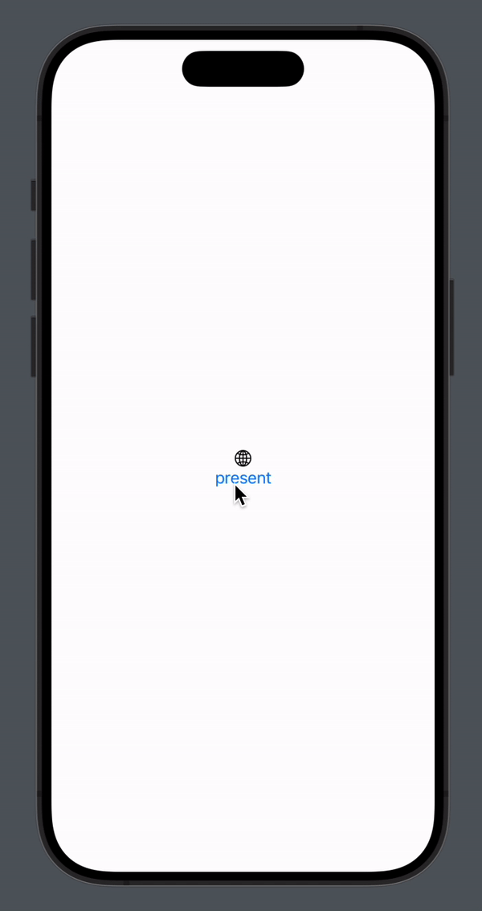
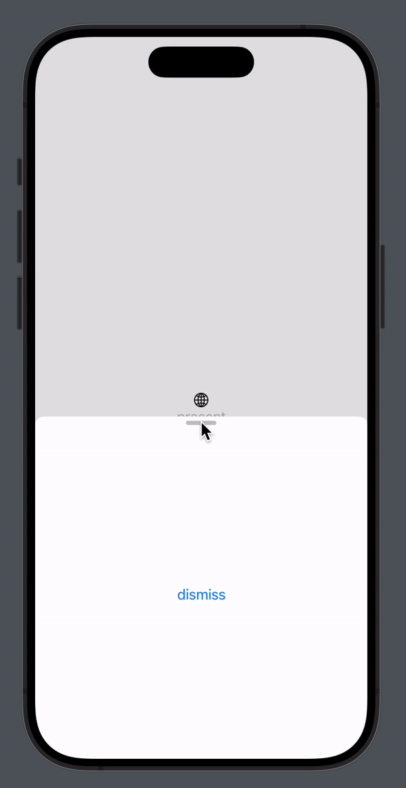
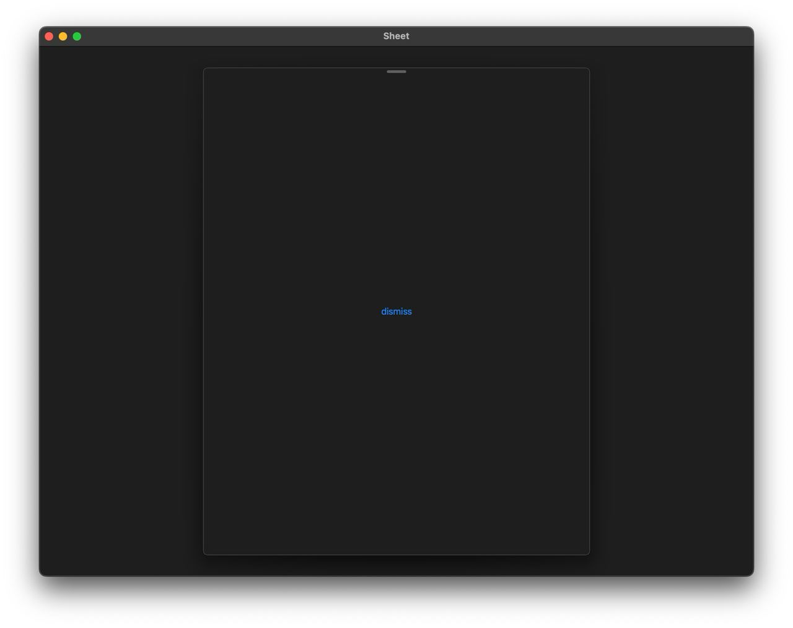
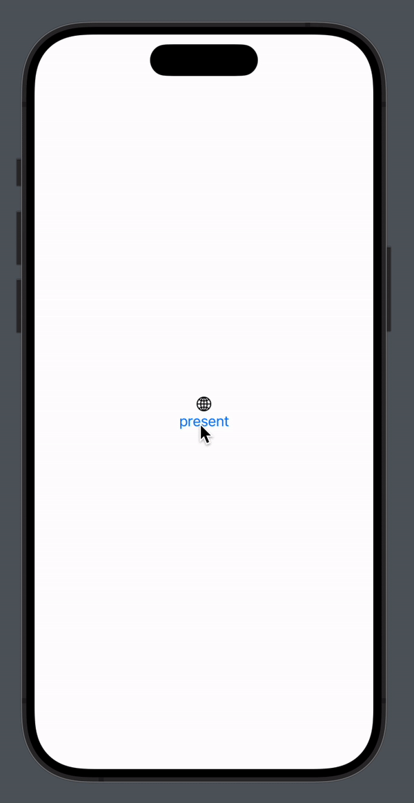

- [Использование .sheet в SwiftUI](#использование-sheet-в-swiftui)
  - [Простой пример использования](#простой-пример-использования)
  - [Кастомное использование](#кастомное-использование)
  - [Что если не sheet](#что-если-не-sheet)

# Использование .sheet в SwiftUI

`.sheet`, прикрепленный ко View, в SwiftUI показывает новое модальное окно,
поверх этого View.

## Простой пример использования

```swift
struct ContentView: View {
    @State private var present = false

    var body: some View {
        VStack {
            Image(systemName: "globe")

            Button("present") {
                present = true
            }
        }
        .sheet(isPresented: $present) {
            Text("asdasd")
        }
    }
}
```



Есть какой-то `@State`, на который триггерится `.sheet`, причем необязательно
`Bool`, есть конфигурация `.sheet` с `Item: Identifiable`:

```swift
public func sheet<Item, Content>(item: Binding<Item?>, onDismiss: (() -> Void)? = nil, @ViewBuilder content: @escaping (Item) -> Content) -> some View where Item : Identifiable, Content : View
```

## Кастомное использование

А теперь самое интересное – используйте `.sheet` **ТОЛЬКО если**:

- Дизайн-система позволяет использование нативного модального окна

**И**

- Вам нужно чтобы пользователь быстро что-то сделал, и окно закрылось. В
  методичке Apple приведен пример с лицензионным соглашением (принял и погнали
  дальше)

В случае, если вам нужна всплывашка, на половину экрана, другой drag indicator
или другие кастомы, то лучше `.sheet` не использовать. К сожалению он не такой
настраиваемый, как `UIPresentationController`.

Есть `.presentationDetents`, который настраивает высоту модального окна,
позволяет делать два положения, к примеру, на половину и полностью:



и другие инструменты:

```swift
.presentationDetents([.medium, .large])
.presentationCornerRadius(30)
.presentationDragIndicator(.visible)
.presentationBackgroundInteraction(.enabled(upThrough: .medium))
```

Но если вы попробуете запустить приложение на mac или iPad, то все они ломаются,
ничего не двигается, положение только одно, но зато драг индикатор остался:



Но допустим приложение чисто под iOS, к тому же можно отдельно сверстать и с
помощью `#if os()`, однако помимо этих инструментов больше ничего нет!

Так же проблемы могут возникнуть с паддингами, ваше View может просто
провалиться куда-то внутрь `sheet`

## Что если не sheet

В SwiftUI есть потрясающий инструмент – `GeometryReader`, в купе с `.gesture` он
позволяет точно отрисовывать любые представления и логику их движения в
зависимости от нажатий:

```swift
@GestureState private var translation: CGFloat = 0
private let content: some View

GeometryReader { geometry in
    content
        .frame(height: geometry.size.height)
        .offset(y: max(translation, 0))
        .gesture(
            DragGesture()
                .updating($translation) { ... }
                .onEnded { ... }
        )
}
```



Выглядит сухо, но можно опять же накидать анимаций, для плавности, теней и т.п.

Полный код:

```swift
struct CustomSheet<Content: View>: View {
    @Binding var isOpen: Bool
    let content: Content

    @GestureState private var translation: CGFloat = 0
    let height: CGFloat = UIScreen.main.bounds.height - 100

    init(
        isOpen: Binding<Bool>,
        @ViewBuilder content: () -> Content
    ) {
        self._isOpen = isOpen
        self.content = content()
    }

    var body: some View {
        GeometryReader { geometry in
            ZStack {
                RoundedRectangle(cornerRadius: 25)
                    .fill(.blue)
                content
            }
            .ignoresSafeArea()
            .frame(maxHeight: height)
            .frame(height: geometry.size.height, alignment: .bottom)
            .offset(y: max(translation, 0))
            .gesture(
                DragGesture()
                    .updating($translation) { value, state, _ in
                        state = value.translation.height
                    }
                    .onEnded { value in
                        guard abs(value.translation.height) > height * 0.5 else {
                            return
                        }

                        isOpen = value.translation.height < 0
                    }
            )
        }
    }
}

```
